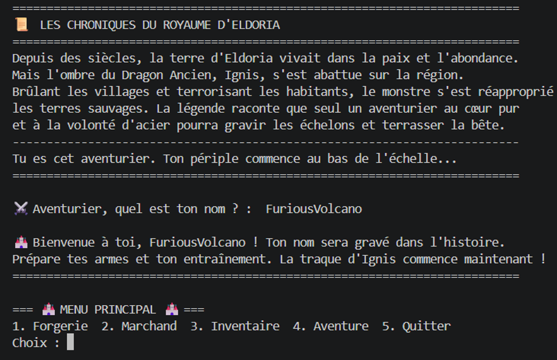
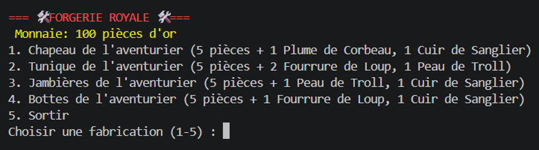
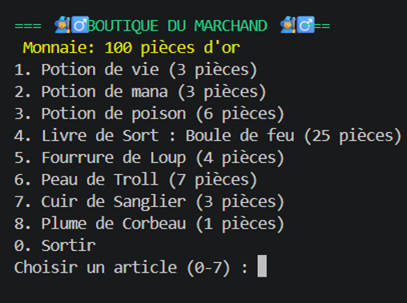
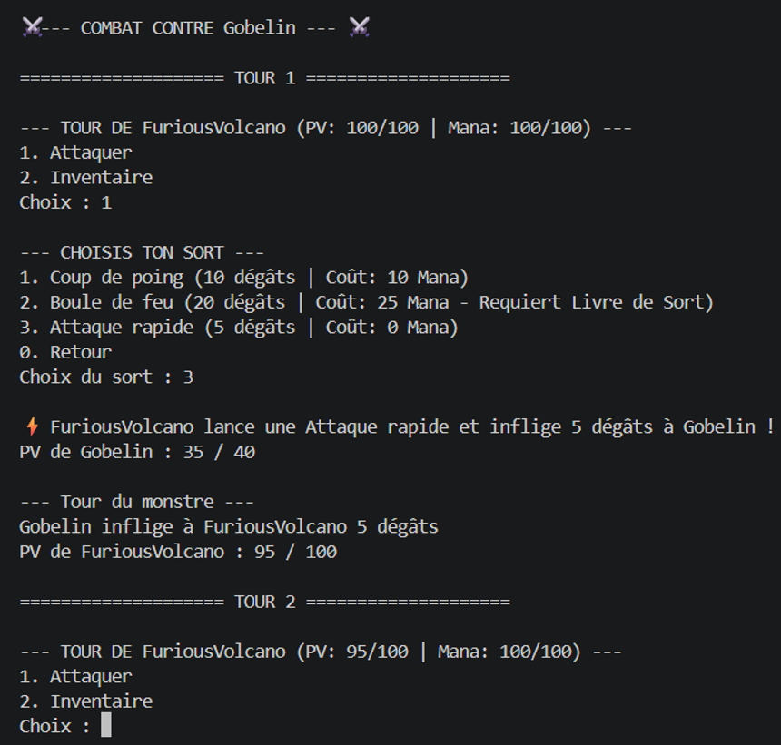

Projet Red : 
RPG sur console en Go

Embarquez dans une aventure épique au cœur du royaume d'Eldoria, terrassez les monstres et devenez une légende !

Projet Red est un jeu de rôle (RPG) textuel développé en Go (Golang). Plongé dans le monde fantastique d'Eldoria, le joueur incarne un aventurier qui doit explorer des donjons, gérer ses ressources, améliorer son équipement chez le forgeron et affronter le redoutable Dragon Ancien, Ignis.

Quelque petit aperçu :
Lore & Création de Personnage : 

Menu Principal : 

Système de Combat : 

Boutique & Forgerie : 

Les fonctionnaliter ont été : 
- Lore & Narration : Introduction immersive et quête principale contre le Dragon Ancien.
- Système de Création de Personnage : Saisie personnalisée du pseudo et caractéristiques -  dynamiques (PV, Mana, Classe).
- Système de Combat au Tour par Tour :
- Attaques physiques et sorts magiques avec consommation de Mana (Coup de poing, Boule de feu, Attaque rapide).
- Patterns d'attaque uniques pour les monstres (Gobelin, Ogre, Dragon).
- Utilisation d'objets en combat (Potions de vie, Potions de poison).
- Gestion de la défaite et soin partiel.

Économie & Marchand :
- Portefeuille de pièces d'or (wallet).
- Achat de potions, équipements et livres de sorts.
- Forgerie & Artisanat : Craft d'équipements à partir de matériaux récoltés.
- Gestion d'Inventaire : Consultation et utilisation des consommables hors et pendant les combats.

Les prérequis pour accéder a notre jeu sont :

- Go (Golang) version 1.20 ou supérieure d'installée sur votre machine.
- Un terminal / invite de commandes (VS Code, PowerShell, Bash).

Puis ensuite on arrive a la phase installation :

- Cloner le dépôt GitHub : git clone https://github.com/RomainThiery/Projet_red.git
- Accéder au dossier du projet : cd Projet_red

Pour lancer le jeu, exécutez la commande suivante dans ton terminal : go run main.go

Pour naviguer dans le jeu il suffit : 

- Entrez votre pseudo lorsque le lore d'introduction s'affiche.
- Utilisez les numéros indiqués à l'écran pour sélectionner une option du menu (ex: 1 pour Forgerie, 2 pour Marchand, 4 pour l'Aventure).

Le projet ne nécessite aucune variable d'environnement externe. Toutes les configurations, caractéristiques initiales du joueur et équilibrages de monstres sont intégrés nativement dans le code source .

Projet_red/
├── character/          # Gestion du personnage, statistiques et inventaire
│   ├── character.go
│   ├── creation.go
│   ├── display.go
│   ├── init.go
│   ├── inventory.go
│   └── item.go
├── Equipment/          
│   └── equipement.go
├── fight/            
│   ├── dead.go
│   └── fight.go
├── Menu/               
│   └── menu.go
├── merchant/           
│   ├── blacksmith.go
│   └── merchant.go
├── Monster/            
│   └── monster.go
├── Wallet/             
│   └── wallet.go
├── go.mod             
└── main.go             

Les licence et version utiliser sont : 

- Langage utilisé : Go (Golang) v1.20+
- IDE conseillé : Visual Studio Code
- Licence : Projet académique open-source. Libre d'utilisation et de modification pour apprentissage.

Projet Red est un projet de jeu de rôle textuel complet créé en Go. Son code est découpé en plusieurs dossiers bien organisés (character, fight, merchant, wallet) pour rendre le projet facile à lire et à faire évoluer. Merci d'avoir joué et sauvé Eldoria !